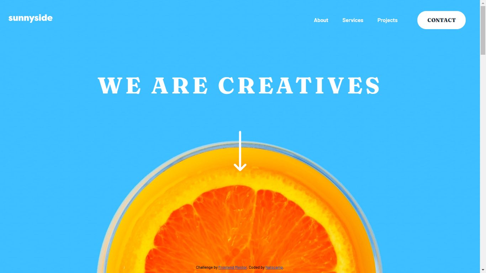

# Frontend Mentor - Sunnyside agency landing page solution

This is a solution to the [Sunnyside agency landing page challenge on Frontend Mentor](https://www.frontendmentor.io/challenges/sunnyside-agency-landing-page-7yVs3B6ef). Frontend Mentor challenges help you improve your coding skills by building realistic projects.

## Table of contents

-   [Overview](#overview)
    -   [The challenge](#the-challenge)
    -   [Screenshot](#screenshot)
    -   [Links](#links)
-   [My process](#my-process)
    -   [Built with](#built-with)
    -   [What I learned](#what-i-learned)
    -   [Useful resources](#useful-resources)
-   [Author](#author)

## Overview

### The challenge

Users should be able to:

-   View the optimal layout for the site depending on their device's screen size
-   See hover states for all interactive elements on the page

### Screenshot



### Links

-   Solution URL: [Solution](https://www.frontendmentor.io/solutions/sunnyside-agency-landing-page-84EKFqfIT)
-   Live Site URL: [Live Demo](https://sunnyside-agency-landing-page-olive.vercel.app/)

## My process

### **Built with**

-   Semantic HTML5 markup
-   Mobile-first workflow
-   CSS custom properties
-   CSS Grid
-   Flexbox
-   Vanilla JavaScript

### **What I Learned**

### - How to create responsive images

You can create responsive images using the picture element combined with the srcset and sizes attributes to display different images based on the device's screen dimensions. Here is a certain use case:

```html
<picture class="showcase__image">
	<source media="(max-width: 425px)" srcset="./images/mobile/image-graphic-design.jpg" />
	
</picture>
```

In the code above, the picture element is used to display the mobile image if the screen width is 425px or less, otherwise it displays the desktop image. You can read more [here](#useful-resources).

### - Using clip-path to mask content

In CSS, the clip-path property can be used to mask the content insode an element with a specified shape. In this example, it was used to create the mobile menu. Here is how it was done:

```css
clip-path: polygon(100% 0, 92.5% 7.5%, 0 7.5%, 0 100%, 100% 100%);
```

The clip-path property can also be animated. So I made an animation for the menu, which is partly controlled by JavaScript.

```js
function toggleMenu(show) {
	menu.className = 'nav nav__links';

	requestAnimationFrame(() => menu.classList.add(show ? 'showing' : 'hidden'));
}
```

The function resets the menu to its default state and then, using requestAnimationFrame, adds the appropriate class based on its state. It was done this way so that the animation can be restarted on-demand.

### **Useful resources**

-   [Responsive Images](https://developer.mozilla.org/en-US/docs/Learn/HTML/Multimedia_and_embedding/Responsive_images) - This article on MDN addresses how to use the picture HTML tag and the srcset attribute to create responsive images on your website.
-   [Clippy - CSS clip-path maker ](https://bennettfeely.com/clippy/) - This is an amazing tool for creating clip-path shapes for CSS.
-   [Animating with Clip-Path](https://css-tricks.com/animating-with-clip-path/) - This article is a great reference for learning how to animate clip-paths in CSS. Highly recommend.

## Author

-   Frontend Mentor - [@Nathan1434](https://www.frontendmentor.io/profile/yourusername)
-   Twitter - [@natscamp02](https://www.twitter.com/natscamp02)
-   Github - [Nathan1434](https://github.com/Nathan1434?tab=repositories)
